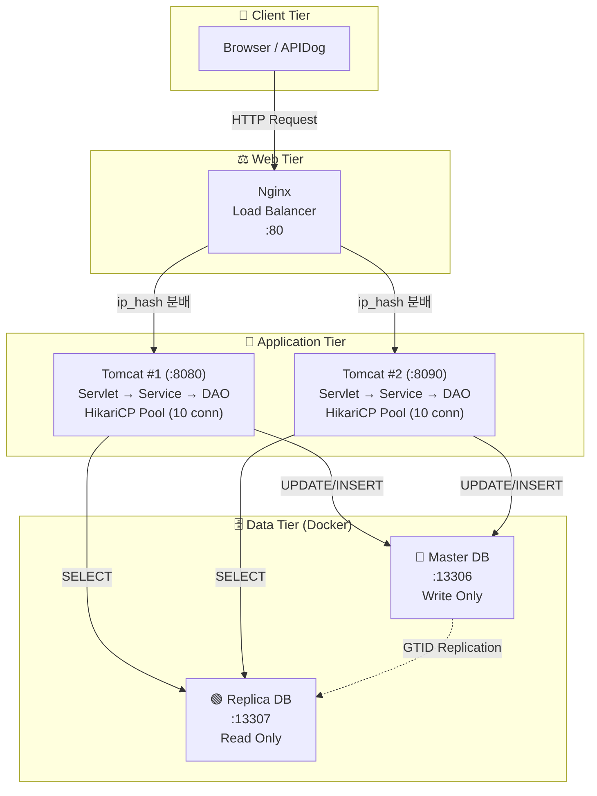
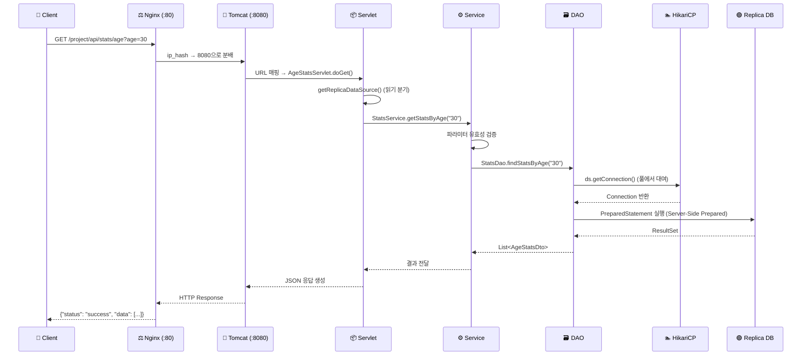
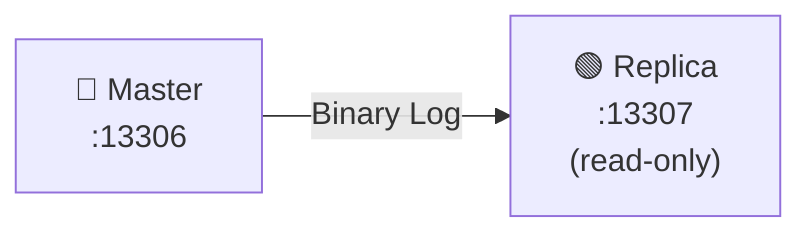

# 🏗️ Woori-FISA 3-Tier Architecture

> **Nginx 로드밸런서 + Tomcat 이중화 + MySQL Master/Replica 구조**를 갖춘 3-Tier 웹 아키텍처 프로젝트

카드 거래 데이터를 기반으로 **연령대별·라이프스테이지별·지역별 소비 통계**를 조회하고, **고객 회원등급을 변경**하는 RESTful API 서버입니다.

---

## 📐 시스템 아키텍처



---

## 🔄 요청 흐름 (Request Flow)

사용자가 `http://localhost/project/api/stats/age?age=30` 요청을 보냈을 때의 전체 여정:



---

## 🧩 핵심 설계 포인트

### 1. Nginx 로드밸런싱 (Web Tier)

```nginx
upstream tomcat-servers {
    ip_hash;                    # 같은 IP → 항상 같은 서버 (Sticky Session)
    server 127.0.0.1:8080;
    server 127.0.0.1:8090;
}
```
- **`ip_hash`** 알고리즘으로 세션 유지 보장
- 톰캣 한 대가 장애 나도 나머지 한 대가 서비스 유지

### 2. DB 읽기/쓰기 분리 (Application Tier)

| API | HTTP Method | DataSource | DB 방향 |
|---|---|---|---|
| `/api/stats/age` | `GET` | `getReplicaDataSource()` | 🟢 Replica (읽기) |
| `/api/stats/lifestage` | `GET` | `getReplicaDataSource()` | 🟢 Replica (읽기) |
| `/api/stats/region` | `GET` | `getReplicaDataSource()` | 🟢 Replica (읽기) |
| `/api/customer/grade` | `PUT` | `getMasterDataSource()` | 🔴 Master (쓰기) |

### 3. HikariCP 커넥션 풀 & Server-Side Prepared Statement

```
jdbc:mysql://host:port/card_db
  ?useServerPrepStmts=true    ← SQL 틀을 DB에 미리 등록, ID로 재사용
  &cachePrepStmts=true        ← Prepare된 ID를 커넥션 내 캐시
  &prepStmtCacheSize=250      ← 최대 250개 SQL 틀 기억
```

### 4. MySQL GTID 기반 자동 복제 (Data Tier)


- Master에 데이터가 변경되면 **자동으로 Replica에 동기화**
- GTID(Global Transaction ID) 기반으로 복제 위치를 정확히 추적

---

## 📁 프로젝트 구조

```
Woori-FISA_3-Tier-Architecture/
├── nginx-config/
│   └── nginx.conf                    # Nginx 로드밸런서 설정
├── docker-compose.yml                # Master/Replica DB 컨테이너 정의
├── setup.sh                          # DB 이중화 자동 세팅 스크립트
├── project/src/main/java/dev/sample/
│   ├── ApplicationContextListener.java   # HikariCP 풀 2개 초기화
│   ├── controller/
│   │   ├── customer/
│   │   │   └── CustomerGradeServlet.java # PUT - 고객등급 변경 (Master)
│   │   └── stats/
│   │       ├── AgeStatsServlet.java      # GET - 연령대별 통계 (Replica)
│   │       ├── LifestageStatsServlet.java# GET - 라이프스테이지별 (Replica)
│   │       └── RegionStatsServlet.java   # GET - 지역별 통계 (Replica)
│   ├── service/
│   │   ├── CustomerService.java          # 고객 비즈니스 로직
│   │   └── StatsService.java             # 통계 비즈니스 로직 + 유효성 검증
│   ├── dao/
│   │   ├── CustomerDao.java              # 고객 DB 접근 (PreparedStatement)
│   │   └── StatsDao.java                 # 통계 DB 접근 (PreparedStatement)
│   ├── dto/                              # 데이터 전송 객체 (Lombok @Builder)
│   └── util/
│       └── JsonResponseUtil.java         # JSON 응답 유틸리티
└── libraries/                            # JAR 라이브러리 (HikariCP, MySQL 등)
```

---

## 🚀 실행 방법

### 1단계: DB 환경 구축 (Docker)

```bash
# Docker 컨테이너 실행 + Master/Replica 복제 설정 + 데이터 로딩
./setup.sh
```

### 2단계: Tomcat 서버 실행 (IDE)

이클립스에서 2개의 Tomcat 서버를 설정합니다:
- **Tomcat #1**: 포트 `8080`
- **Tomcat #2**: 포트 `8090`

두 서버 모두 프로젝트를 배포(Add and Remove)하고 Start합니다.

### 3단계: Nginx 로드밸런서 실행

```bash
nginx -p "<Nginx 설치 경로>\" -c "<프로젝트 경로>\nginx-config\nginx.conf"
```

### 4단계: API 테스트

```bash
# 통계 조회 (Nginx 경유 → Replica DB)
GET http://localhost/project/api/stats/age?age=30
GET http://localhost/project/api/stats/lifestage?lifeStage=NEW_WED
GET http://localhost/project/api/stats/region

# 고객 등급 변경 (Nginx 경유 → Master DB)
PUT http://localhost/project/api/customer/grade
Body (x-www-form-urlencoded): seq=1001, mbrRk=22
```

---

## 🛠️ 기술 스택

| 계층 | 기술 | 역할 |
|---|---|---|
| Web Tier | **Nginx 1.28** | 로드밸런싱, 리버스 프록시 |
| App Tier | **Apache Tomcat 9.0** | 서블릿 컨테이너 (×2대) |
| App Tier | **Java 17 + Servlet API** | RESTful API 비즈니스 로직 |
| App Tier | **HikariCP** | JDBC 커넥션 풀 관리 |
| App Tier | **Lombok** | 보일러플레이트 코드 제거 |
| App Tier | **Logback (SLF4J)** | 애플리케이션 로깅 |
| Data Tier | **MySQL 8.0 (Docker)** | RDBMS (Master + Replica) |

---

## 👥 팀원

| 이름 | 역할 |
|---|---|
| **팀원 A** | DB 이중화 설정 (`docker-compose.yml`, `setup.sh`) |
| **팀원 B** | Nginx 로드밸런서 설정 (`nginx.conf`) |
| **팀원 C** | 애플리케이션 코드 (Servlet, Service, DAO, HikariCP 이중화) |