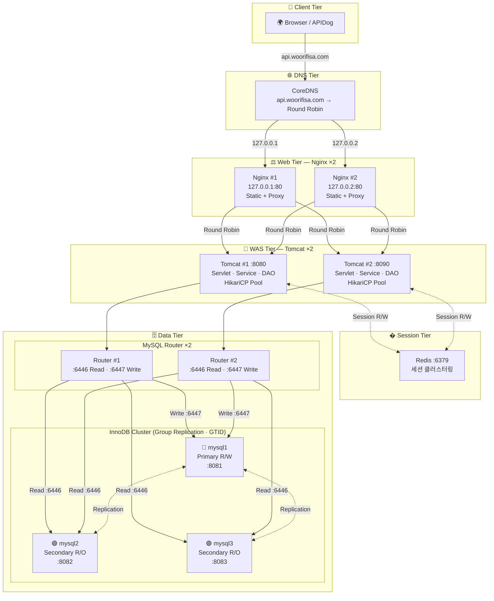

# 🏗️ Woori-FISA 3-Tier Architecture

> **DNS 라운드 로빈 + Nginx 이중화 + Tomcat 이중화 + InnoDB Cluster** 를 갖춘 완전한 3-Tier HA(고가용성) 웹 아키텍처

카드 거래 데이터를 기반으로 **연령대별·라이프스테이지별·지역별 소비 통계**를 조회하고, **고객 회원등급을 변경**하는 RESTful API 서버입니다.

---

## 📐 시스템 아키텍처


### SPOF(단일 장애점) 제거 및 고가용성 현황

| 계층 | 구성 | 장애 시나리오 | 결과 |
|---|---|---|---|
| **DNS** | CoreDNS (라운드 로빈) | Nginx 1대 장애 | 다른 IP의 Nginx로 자동 분배 |
| **WEB** | Nginx ×2대 (IP 분리) | Nginx 1대 장애 | 나머지 Nginx가 서비스 유지 |
| **WAS** | Tomcat ×2대 | Tomcat 1대 장애 | Nginx가 살아있는 Tomcat으로 전환 |
| **세션** | Redis (단일망) | Tomcat 장애 시 | **다른 Tomcat에서 즉시 Redis 세션 인계** |
| **DB** | InnoDB Cluster ×3대 | Primary 장애 | Secondary가 자동 승격 (Failover) |

---

## 🚀 실행 방법 (순서대로!)

> ⚠️ **반드시 아래 순서대로 실행해야 합니다!** (의존성: DB → WAS → WEB → DNS 설정)

### STEP 1. DB 클러스터 가동 (MySQL 3대)

```bash
cd docker/DB
docker-compose up -d
```

### STEP 2. InnoDB Cluster 초기화 (최초 1회 또는 전체 재시작 후)

MySQL Shell 컨테이너를 임시로 띄워서 클러스터를 구성합니다.

```bash
# MySQL Shell 접속
docker exec -it mysql1 mysqlsh root@mysql1:8081
```

**최초 구성 시:**
```javascript
// 인스턴스 설정
dba.configureInstance('root@mysql1:8081')
dba.configureInstance('root@mysql2:8082')
dba.configureInstance('root@mysql3:8083')

// 클러스터 생성
\c root@mysql1:8081
var cluster = dba.createCluster('sqlCluster', {localAddress: 'mysql1:8081'});
cluster.addInstance('root@host.docker.internal:8082', {localAddress: 'mysql2:8082'});
cluster.addInstance('root@host.docker.internal:8083', {localAddress: 'mysql3:8083'});
cluster.status();
```

**재시작 후 복구 시:**
```javascript
\c root@mysql1:8081
dba.rebootClusterFromCompleteOutage()
var cluster = dba.getCluster()
cluster.status()
```

### STEP 3. SESSION 관리 가동 (Redis)

톰캣 이중화 환경에서 사용자의 로그인 세션을 어느 톰캣으로 접속하든 잃지 않고 유지해주는 **세션 클러스터링소**입니다.

```bash
cd docker/SESSION
docker-compose up -d
```

### STEP 4. WAS 가동 (Router 2대 + Tomcat 2대)

```bash
cd docker/WAS
docker-compose up -d
```

> 💡 `.war` 파일은 `docker/WAS/` 에 `sample-project1.war`, `sample-project2.war` 이름으로 배치합니다. Tomcat 구동 시 Redis와 자동으로 커넥션을 맺습니다.

### STEP 5. WEB 가동 (Nginx 2대 + CoreDNS)

```bash
cd docker/WEB
docker-compose up -d
```

### STEP 5. 전체 컨테이너 상태 확인

```bash
docker ps --format "table {{.Names}}\t{{.Status}}\t{{.Ports}}"
```

**기대 결과 (총 10개 컨테이너):**

| 컨테이너 | 포트 | 역할 |
|---|---|---|
| `coredns` | :53 (UDP/TCP) | DNS 라운드 로빈 서버 |
| `nginx1` | 127.0.0.1:**80** | 로드밸런서 #1 + 정적 리소스 |
| `nginx2` | 127.0.0.2:**80** | 로드밸런서 #2 + 정적 리소스 |
| `tomcat-app1` | **:8080** | WAS #1 (API 전용) |
| `tomcat-app2` | **:8090** | WAS #2 (API 전용) |
| `redis-session` | **:6379** | Redis 세션 호스트 |
| `router1` | - | MySQL Router #1 |
| `router2` | - | MySQL Router #2 |
| `mysql1` | **:8081** | DB Primary (R/W) |
| `mysql2` | **:8082** | DB Secondary (R/O) |
| `mysql3` | **:8083** | DB Secondary (R/O) |

### STEP 6. Windows DNS 설정 변경 (필수!)

> ⚠️ **이 단계를 하지 않으면 CoreDNS가 동작하지 않습니다!**
> CoreDNS는 DNS 서버일 뿐이고, Windows가 CoreDNS에게 "물어보도록" 설정해줘야 합니다.
> 실무에서는 Kubernetes가 자동으로 해주지만, 로컬 PC에서는 수동 설정이 필요합니다.

#### 🔧 DNS 설정 방법 (테스트 시작 전)

1. **Windows 키** → **"Wi-Fi 설정"** 검색 → 클릭
2. **하드웨어 속성** 클릭
3. **DNS 서버 할당** 옆의 **"편집"** 클릭
4. **"자동(DHCP)"**를 **"수동"**으로 변경
5. **IPv4** 켜기
6. 아래 값 입력:
   - 기본 DNS: `127.0.0.1` (CoreDNS로 라운드 로빈 응답)
   - 보조 DNS: `8.8.8.8` (Google DNS — 인터넷 다른 사이트 접속용)
7. **저장**

#### ✅ DNS 라운드 로빈 동작 확인

```bash
nslookup api.woorifisa.com
```
```
# 기대 결과:
이름:    api.woorifisa.com
Addresses:  127.0.0.1     ← Nginx #1
            127.0.0.2     ← Nginx #2
```
두 개의 IP가 반환되면 DNS 라운드 로빈 성공!

#### 🔄 DNS 되돌리기 (테스트 종료 후 — 반드시!)

> ⚠️ CoreDNS 컨테이너를 끄기 전에 DNS를 먼저 되돌려야 합니다!
> 안 되돌리면 DNS 질의가 꺼진 CoreDNS로 가서 인터넷이 안 될 수 있습니다.

1. **Windows 키** → **"Wi-Fi 설정"** 검색 → 클릭
2. **하드웨어 속성** 클릭
3. **DNS 서버 할당** 옆의 **"편집"** 클릭
4. **"수동"**을 **"자동(DHCP)"**로 변경
5. **저장**

### STEP 7. API 테스트 (로그인 & 데이터 처리)

> 🚨 **주의:** `AuthenticationFilter`로 인해 `/api/auth/*` 이외의 모든 경로는 로그인하지 않으면 **`401 Unauthorized`** 로 차단됩니다! 먼저 로그인을 수행하세요.

```bash
# 1. 사용자 로그인 (Session은 Redis에 기록됨!)
POST http://api.woorifisa.com/project/api/auth/login
Body (application/json): {"id":"admin", "password":"1234"}
# 로그인 성공 후 반환되는 JSESSIONID 쿠키를 들고 다닙니다.

# 2. 통계 조회 (DNS 라운드 로빈 → Nginx → Tomcat(세션 검증) → Replica DB)
GET http://api.woorifisa.com/project/api/stats/region
GET http://api.woorifisa.com/project/api/stats/age?age=30
GET http://api.woorifisa.com/project/api/stats/lifestage?lifeStage=NEW_WED

# 3. 고객 등급 변경 (DNS 라운드 로빈 → Nginx → Tomcat(세션 검증) → Master DB)
PUT http://api.woorifisa.com/project/api/customer/grade
Body (x-www-form-urlencoded): seq=1001, mbrRk=22

# 4. 사용자 로그아웃
POST http://api.woorifisa.com/project/api/auth/logout
```

---

## 🧩 핵심 설계 포인트

### 1. DNS 라운드 로빈 (CoreDNS)

하나의 도메인에 IP를 2개 등록하여, 요청마다 Nginx 1 → 2 → 1 → 2 순서로 분배합니다.

```
; DNS Zone 파일 (db.woorifisa.com)
api   IN  A   127.0.0.1    ← Nginx #1
api   IN  A   127.0.0.2    ← Nginx #2
```

### 2. Nginx 정적 리소스 직접 제공 + API 프록시 분리

Nginx가 정적 파일(HTML, CSS, JS)은 **직접 응답**하고, API 요청만 톰캣으로 전달합니다.
톰캣은 API 처리에만 집중하므로 **톰캣 부하가 감소**합니다.

```nginx
# 정적 파일 → Nginx가 직접 제공 (톰캣 안 거침)
location /project/ {
    alias /usr/share/nginx/html/;
    expires 7d;
}

# API 요청만 → 톰캣으로 전달
location /project/api/ {
    proxy_pass http://tomcat-servers;
}
```

| 요청 경로 | 처리하는 서버 | 비고 |
|---|---|---|
| `/project/index.html` | **Nginx** (직접) | 빠름, 톰캣 부하 없음 |
| `/project/api/stats/region` | **Tomcat** (프록시) | API만 톰캣이 처리 |

### 3. Nginx 로드밸런싱 (Round Robin) + Redis 무상태(Stateless) 아키텍처

기존에는 Nginx에서 서버 간 세션 불일치 문제를 해결하기 위해 `ip_hash;`를 사용하여 특정 클라이언트의 트래픽을 한 Tomcat으로 고정했습니다(Sticky Session).
그러나 이 구조는 특정 서버가 과부하를 받더라도 완화할 수 없다는 치명적 단점이 있습니다.

현 아키텍처에서는 **Redisson(Redis)**을 통하여 **Tomcat 간 세션 클러스터링(공유)**이 구성되었습니다.
즉, WAS가 상태를 갖지 않는 무상태(Stateless) 형태로 탈바꿈하였으며, 이에 따라 Nginx는 `ip_hash`의 족쇄에서 벗어나 **트래픽을 완벽히 1:1로 분산하는 `Round Robin`(기본값)** 배분이 가능해졌습니다.

```nginx
upstream tomcat-servers {
    # ip_hash;  <-- 제거됨! Redis가 세션을 보장하므로 더 이상 필요하지 않음.
    server host.docker.internal:8080;
    server host.docker.internal:8090;
}
```

#### 세션 Failover 동작 원리
1. 사용자가 Tomcat 1을 통해 로그인. 이때 `JSESSIONID` 값과 내용이 Redis에 저장됨.
2. 이후 사용자의 요청이 Tomcat 2로 분배됨 (Round Robin)
3. Tomcat 2는 로컬 메모리에 해당 세션이 없지만, Redis를 조회하여 사용자가 인증된 상태임을 판별함.
4. Tomcat 1 서버가 물리적으로 폭파(Down)되어도 사용자는 로그인이 풀리지 않고 정상적으로 서비스 이용이 가능(Failover)함!

### 4. DB 읽기/쓰기 분리

| API | Method | DataSource | DB 방향 |
|---|---|---|---|
| `/api/stats/age` | `GET` | `getReplicaDataSource()` | 🟢 Replica (읽기) |
| `/api/stats/lifestage` | `GET` | `getReplicaDataSource()` | 🟢 Replica (읽기) |
| `/api/stats/region` | `GET` | `getReplicaDataSource()` | 🟢 Replica (읽기) |
| `/api/customer/grade` | `PUT` | `getMasterDataSource()` | 🔴 Master (쓰기) |

### 5. Server-Side Prepared Statement

```
jdbc:mysql://host:port/card_db
  ?useServerPrepStmts=true     ← SQL 틀을 DB에 미리 등록, ID로 재사용
  &cachePrepStmts=true         ← Prepare된 ID를 캐시
  &prepStmtCacheSize=250       ← 최대 250개 SQL 틀 기억
```

### 6. InnoDB Cluster (Group Replication)

| 구성 요소 | 설명 |
|---|---|
| **InnoDB Cluster** | 3개 MySQL 노드가 Group Replication으로 자동 동기화 |
| **MySQL Router** | 애플리케이션 → 클러스터 간 자동 라우팅 (R/W 분리) |
| **Automatic Failover** | Primary 장애 시 Secondary가 자동 승격 |


### 7. 데이터베이스 테이블 및 성능 최적화(인덱스)

데이터 조회의 성능을 향상시키기 위해 연령대(`AGE`), 라이프스테이지(`LIFE_STAGE`), 지역(`HOUS_SIDO_NM`) 컬럼에 대한 인덱스를 생성합니다.

```sql
CREATE TABLE IF NOT EXISTS `CARD_TRANSACTION` (
    
--테이블 스키마
  
) ENGINE=InnoDB DEFAULT CHARSET=utf8mb4 COLLATE=utf8mb4_0900_ai_ci;

-- 통계 조회 성능 향상을 위한 인덱스 생성
CREATE INDEX age_idx ON CARD_TRANSACTION (AGE);
CREATE INDEX lifestage_idx ON CARD_TRANSACTION (LIFE_STAGE);
CREATE INDEX region_idx ON CARD_TRANSACTION (HOUS_SIDO_NM);
```

---

## 📁 프로젝트 구조

```
Woori-FISA_3-Tier-Architecture/
├── docker/
│   ├── DB/
│   │   └── docker-compose.yml          # MySQL 3대 (InnoDB Cluster)
│   ├── WAS/
│   │   ├── docker-compose.yml          # Router 2대 + Tomcat 2대
│   │   ├── sample-project1.war         # Tomcat #1용 WAR
│   │   └── sample-project2.war         # Tomcat #2용 WAR
│   └── WEB/
│       ├── docker-compose.yml          # Nginx 2대 + CoreDNS
│       └── coredns/
│           ├── Corefile                # CoreDNS 설정
│           └── db.woorifisa.com        # DNS Zone (라운드 로빈)
├── nginx-config/
│   ├── nginx.conf                      # Nginx 로드밸런서 + 정적/API 분기 설정
│   └── static/
│       └── index.html                  # 클라이언트 대시보드 페이지 (Nginx가 직접 제공)
├── project/src/main/java/dev/sample/
│   ├── ApplicationContextListener.java # HikariCP 풀 2개 초기화
│   ├── controller/
│   │   ├── auth/
│   │   │   ├── LoginServlet.java       # POST - 로그인, Redis에 세션 적재
│   │   │   ├── LogoutServlet.java      # POST - 로그아웃
│   │   │   └── MeServlet.java          # GET - 현재 로그인된 내 정보 조회
│   │   ├── customer/
│   │   │   └── CustomerGradeServlet.java   # PUT - 고객등급 변경 (인증됨)
│   │   └── stats/
│   │       ├── AgeStatsServlet.java        # GET - 연령대별 통계 (인증됨)
│   │       ├── LifestageStatsServlet.java  # GET - 라이프스테이지별 (인증됨)
│   │       └── RegionStatsServlet.java     # GET - 지역별 통계 (인증됨)
│   ├── filter/
│   │   └── AuthenticationFilter.java   # 로그인하지 않은 사용자의 데이터 API(stats/customer) 접근 차단 401
│   ├── service/                        # 비즈니스 로직 + 유효성 검증
│   ├── dao/                            # DB 접근 (PreparedStatement)
│   ├── dto/                            # 데이터 전송 객체 (Lombok, Authentication Serializable)
│   └── util/                           # JSON 응답 유틸리티
└── libraries/                          # JAR 라이브러리 추가 (Redisson, Jackson)
```

---

## 🛠️ 기술 스택

| 계층 | 기술 | 역할 |
|---|---|---|
| DNS | **CoreDNS 1.12** | DNS 라운드 로빈 (SPOF 제거) |
| Web | **Nginx 1.28 ×2대** | 로드밸런싱, 리버스 프록시, API-Static 분리 |
| App | **Tomcat 9.0 ×2대** | 서블릿 컨테이너 |
| App | **Java 17 + Servlet API** | RESTful API |
| App | **HikariCP** | JDBC 커넥션 풀 |
| App | **Redisson** | Redis 연동 (Session Manager) |
| App | **Lombok + Jackson + Logback** | 코드 생산성, JSON, 로깅 |
| Data | **Redis 7.2** | 세션 클러스터링 저장소 |
| Data | **MySQL 8.0 ×3대** | InnoDB Cluster (Group Replication) |
| Data | **MySQL Router ×2대** | 자동 R/W 라우팅 |
| Infra | **Docker Compose** | 컨테이너 오케스트레이션 |
